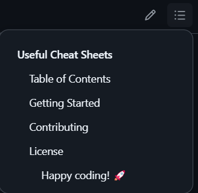

# Markdown Cheat Sheet

## What is Markdown?

Markdown is a lightweight markup language that you can use to add formatting elements to plaintext
text documents. Markdown is now one of the world's most popular markup languages.

Using Markdown is different than using a [WYSIWYG](https://en.wikipedia.org/wiki/WYSIWYG) editor.
In an application like Microsoft Word, you click buttons to format words and phrases, and the
changes are visible immediately. Markdown isn't like that. When you create a Markdown-formatted
file, you add Markdown syntax to the text to indicate which words and phrases should look different.

You can add Markdown formatting elements to a plaintext file using a text editor application. Or
you can use one of the many Markdown applications for macOS, Windows, Linux, iOS, and Android
operating systems. There are also several web-based applications specifically designed for writing
in Markdown.

## Table of Contents

- [Headings](#headigns)
- [Styling Text](#styling-text)
- [Quoting Text](#quoting-text)

## Headigns

To create a heading, add one to six `#` symbols before your heading text. The number of `#` you use
will determine the hierarchy level and typeface size of the heading.

```text
# A first-level heading
## A second-level heading
### A third-level heading
#### A fourth-level heading
##### A fifth-level heading
###### A sixth-level heading

Alternatively, for H1 and H2, an underline-ish style can be used:

Alt-H1
======

Alt-H2
------
```

### Output

# A first-level heading

## A second-level heading

### A third-level heading

#### A fourth-level heading

##### A fifth-level heading

###### A sixth-level heading

> [!NOTE]
> When you use two or more headings, GitHub automatically generates a table of contents that you
> can access by clicking the icon with three dashes and three dots within the file header, next to
> the edit/pencil icon. Each heading title is listed in the table of contents and you can click a
> title to navigate to the selected section.



## Styling text

You can indicate emphasis with bold, italic, strikethrough, subscript, or superscript text.

| Style | Syntax | Example | Output |
| ----- | ------ | ------- | ------ |
| Bold  | `** **` or `__ __` | `**This is bold text**` | **This is bold text** |
| Italic | `* *` or `_ _` | `*This text is italicized*` | *This text is italicized* |
| Strikethrough | `~~ ~~` | `~~This was mistaken text~~` | ~~This was mistaken text~~ |
| Bold and nested italic | `** **` and `_ _` | `**This text is _extremely_ important**` | **This text is _extremely_ important** |
| All bold and italic | `*** ***` | `***All this text is important***` | ***All this text is important*** |
| Subscript | `<sub> </sub>` or `~ ~` | `This is a <sub>subscript</sub> text` | This is a <sub>subscript</sub> text |
| Superscript | `<sup> </sup>` or `^ ^` | `This is a <sup>superscript</sup> text` | This is a <sup>superscript</sup> text |

## Quoting text

You can quote text with a `>` and nest quote text adding additional greater-than signs, e.g. `>>`.

```text
> This is a quoted text.
>> This is a nested quoted text.
>>> This is an even more nested quoted text.
>>>> Yet another nested quoted text.
>>>>> How many of these can we have?
>>>>>> Oh, yes! Another one.
>>>>>>> What is this?
>>>>>>>> Yep, a very very very nested quoted text.
>>>>>>>>> Can we go further?
>>>>>>>>>> To be continued...
```

### Output

> This is a quoted text.
>> This is a nested quoted text.
>>> This is an even more nested quoted text.
>>>> Yet another nested quoted text.
>>>>> How many of these can we have?
>>>>>> Oh, yes! Another one.
>>>>>>> What is this?
>>>>>>>> Yep, a very very very nested quoted text.
>>>>>>>>> Can we go further?
>>>>>>>>>> To be continued...
